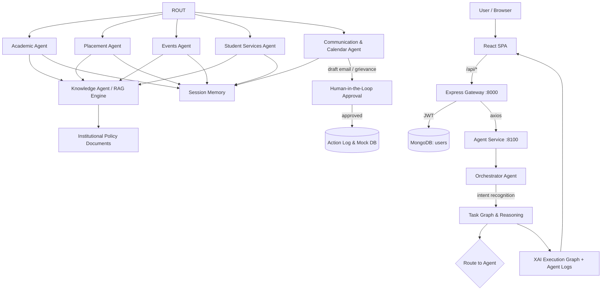

# AgentX — Smart Campus Multi-Agent AI System

A prototype multi-agent AI assistant for a smart campus, built for the **AgentX National Level Hackathon 2026**.

The system coordinates **6 specialized agents** through an **orchestrator** that plans tasks, calls tools, retrieves institutional policies with a keyword-based RAG engine, retains session memory, and gates high-stakes actions (emails, grievance tickets) behind **Human-in-the-Loop (HITL)** approval.

> Project by: **XYZ Engineering College — HackerRank Campus Crew**

---

## Stack overview

The app is a **MERN + Python** architecture split into three processes:

| Process | Technology | Role | Port |
| --- | --- | --- | --- |
| **UI** | React 19 + Vite | SPA frontend (Paper & Forest theme) | `5173` (dev) |
| **API gateway** | Express 5 (Node) | Auth (JWT), API routes, proxies to Python | `8000` |
| **Agent service** | Python (stdio http.server) | Orchestrator + agents + RAG + mock data | `8100` |
| **MongoDB** | Mongoose | User accounts only (uid → JWT) | `27017` |

- Browser talks only to the Express gateway (`/api/*`). The gateway proxies agent reads to the Python service with `axios` (baseURL `AGENT_SERVICE_URL`, 30s timeout).
- The **Python agent engine is unchanged** — `agent-service/` is a zero-dependency HTTP wrapper around the same `backend/` code as the original demo.

> `main` is frozen at the original demo. All MERN work lives on the `mern-migration` branch.

---

## Quick Start

### Prerequisites
- Node.js 18+ (tested on Node 22)
- Python 3.7+ (tested on 3.12) — no pip installs needed
- MongoDB running locally (`mongodb://localhost:27017`)

### Setup (one-time)

```powershell
cd C:\SOHAN1\agentx
npm install                  # root (concurrently)
npm install --prefix server  # Express gateway
npm install --prefix client  # React UI
Copy-Item server\.env.example server\.env   # then edit if needed
```

### Seed users, then run everything

```powershell
npm run seed     # creates/updates the 4 demo accounts (idempotent)
npm run dev      # starts API (cyan) + AGENT (magenta) + UI (green) with labelled output
```

Then open **http://localhost:5173** and sign in.

### Stop
Press `Ctrl+C` in the terminal (or the trash icon in VS Code / the `dev` terminal tab). If the port is still held:

```powershell
Get-NetTCPConnection -LocalPort 8000,8100,5173 | Stop-Process -Id { $_.OwningProcess } -Force
```

> VS Code users: the `.vscode/launch.json` "AgentX: Run All" launch does the same `npm run dev` under an integrated terminal preset. Double-click the launch config (left bar → Run and Debug).

---

## Demo accounts

| Name | UID | Password | Role |
| --- | --- | --- | --- |
| Alex Chen (CSE 3rd Yr) | `chen` | `chen@2026` | student |
| Priya Sharma (ECE 4th Yr) | `priya` | `priya@2026` | student |
| Rahul Verma (ME 2nd Yr) | `rahul` | `rahul@2026` | student |
| System Administrator | `admin` | `admin@2026` | admin |

Tap the UID field on the login card, or paste the demo hint text shown under the card.

---

## What it does

The assistant answers campus questions and executes multi-step tasks by routing your prompt to specialized agents:

| Agent | Capability |
| --- | --- |
| **Academic Agent** | Timetables, attendance calculation, elective recommendations |
| **Placement Agent** | Internship eligibility checks, resume analysis |
| **Events Agent** | Workshop discovery, event registration |
| **Knowledge Agent (RAG)** | Retrieval from institutional policies & handbooks |
| **Communication & Calendar Agent** | Email drafting (HITL), calendar events, reminders |
| **Student Services Agent** | Hostel info, scholarships, transport, FAQs, grievances |

### Demo scenarios (type these in Chat)
1. **Google Internship** eligibility + workshop registration + calendar + reminder
2. **Exam regulations** summary + attendance + make-up-exam email (HITL)
3. **Today's classes** + AI workshops + ML clubs
4. **Hostel + scholarships** + grievance filing (HITL)
5. **Personalized electives** + resume analysis

Each answer includes the **XAI execution graph** (which agent ran, in what order — rendered by `client/src/components/ExecutionGraph.jsx`) and **live agent logs**.

---

## Environment variables (server/.env)

```
PORT=8000
JWT_SECRET=agentx_dev_secret_change_later
JWT_EXPIRES_IN=1d
MONGO_URI=mongodb://localhost:27017/agentx
AGENT_SERVICE_URL=http://localhost:8100
```

`.env` is git-ignored (`server/.env` in `.gitignore`); `.env.example` is the template.

---

## API reference

Base URL: `http://localhost:8000/api`

| Method | Endpoint | Description | Auth |
| --- | --- | --- | --- |
| POST | `/api/auth/login` | Login with `{uid, password}` → `{token, user}` | no |
| POST | `/api/auth/logout` | Stateless; client drops the token | yes |
| GET | `/api/auth/me` | Return current user from DB | yes |
| POST | `/api/chat` | Send `{query}` → agent response incl. graph + logs | yes |
| POST | `/api/rag/search` | `{query, top_k?}` → RAG results w/ scores | yes |
| GET | `/api/health` | System health, loaded agents, RAG doc count | yes |
| GET | `/api/students` | All student profiles | yes |
| GET | `/api/events` | Campus events | yes |
| GET | `/api/internships` | Internship listings | yes |
| GET | `/api/scholarships` | Scholarship opportunities | yes |
| GET | `/api/transport` | Bus routes | yes |
| GET | `/api/faqs` | Campus FAQs | yes |
| GET | `/api/grievances` | Filed grievance tickets | yes |
| GET | `/api/actionlog` | Recent action log (last 50) + total | yes |
| POST | `/api/hitl/respond` | `{draft_id, action: approve/reject}` | yes |

JWT flow: send `Authorization: Bearer <token>`. Headers — `Content-Type: application/json`, token stored under the key `agentx_token` in localStorage.

### Example — login

```bash
curl -X POST http://localhost:8000/api/auth/login \
  -H "Content-Type: application/json" \
  -d '{"uid":"chen","password":"chen@2026"}'
```

### Example — chat query (after login)

```bash
curl -X POST http://localhost:8000/api/chat \
  -H "Content-Type: application/json" \
  -H "Authorization: Bearer <token>" \
  -d '{"query":"am I eligible for the Google internship"}'
```

---

## Frontend internals

- **Stack**: React 19, `react-router-dom` (v7), `lucide-react` icons, Vite. No CSS framework — scoped stylesheets + CSS custom properties.
- **Theme**: Paper & Forest — `tokens.css` defines the palette: `--paper #F2EFE6`, `--surface #FFF`, `--ink #1B241C`, `--ink-soft #5C6459`, `--lime #CFEE4E`, `--moss #4B5D48`, `--forest #16241C`, `--forest-2 #1D2E22`, etc. Fonts: **Manrope** (display/body) + **JetBrains Mono** (mono/fields).
- **Routing** (in `client/src/App.jsx`):

| Path | Page |
| --- | --- |
| `/login` | LoginPage (named card + demo hint) |
| `/dashboard` | DashboardPage |
| `/chat` | ChatPage |
| `/student` | StudentPage |
| `/services` | ServicesPage |
| `/knowledge` | KnowledgePage |
| `*` | redirect → `/dashboard` |

- Protected app shell = `RequireAuth` wrapping `AppShell` (renders TopBar + pages + footer). Login page is public.
- **Auth context** (`client/src/context/AuthContext.jsx`): `useAuth()` returns `{ user, token, ready, login, logout }`. Sessions persist via localStorage (`agentx_token`/`agentx_user`) and are re-validated on load with `/api/auth/me`.
- **API helper** (`client/src/api/client.js`): `api.login`, `api.logout`, `api.me`, `api.chat`, `api.ragSearch`, `api.health`, `api.students`... `api.hitlRespond(draft_id, action)`.

---

## Project structure

```
agentx/
├── package.json       # root scripts: dev / api / agent / ui / build / seed
├── .gitignore
├── README.md
├── server/            # Express gateway
│   ├── .env.example
│   └── src/
│       ├── server.js               # Express bootstrap + SPA static serving
│       ├── config/db.js            # Mongoose connection
│       ├── models/User.js          # uid, name, studentId, role, passwordHash
│       ├── middleware/auth.js      # signToken() + authGuard (JWT)
│       ├── routes/{index,auth,chat,rag,misc}.js
│       ├── services/agentClient.js # axios → Python :8100
│       └── seed/seed.js            # upserts demo users
├── client/           # React SPA
│   ├── vite.config.js              # :5173 + /api proxy → :8000
│   ├── index.html
│   └── src/
│       ├── main.jsx, App.jsx
│       ├── api/client.js           # fetch wrapper + token helpers
│       ├── context/                # AuthContext, authContextValue, useAuth
│       ├── styles/                 # tokens.css, base.css, responsive.css
│       ├── components/             # AppShell, TopBar, AgentPulse, ProfileMenu, RequireAuth, ExecutionGraph, Markdown
│       └── pages/                 # Login, Dashboard, Chat, Student, Services, Knowledge
└── agent-service/    # Python agent HTTP service
    ├── api.py                     # stdlib http.server → :8100
    └── backend/                   # unchanged engine
        ├── main.py
        ├── agents/{orchestrator, specialized_agents}.py
        ├── rag/rag_engine.py
        └── data/mock_db.py
```

---

## Architecture diagram

**Mermaid** (renders on GitHub):



---

## How it works (honest, PoC notes)

- **Multi-agent orchestration** — a single `OrchestratorAgent` classifies intent and dispatches to specialized tool-calling agents. The execution graph and logs are returned to the UI.
- **RAG** — a built engine does token-overlap + keyword boosting over 3 hardcoded institutional documents (no external vector DB). Lightweight, deterministic, suitable for a PoC.
- **Tools / function calling** — agents expose mock tools (e.g. `register_event`, `draft_email`, `file_grievance`) that mutate an in-memory store and return structured `data` + `summary`.
- **Autonomous planning** — simulated with purpose-built multi-step workflows triggered by intent keywords, then visualized as a task plan (execution graph).
- **Memory** — the orchestrator retains the last N queries and surfaces them as "recent requests".
- **HITL** — emails and grievances are never "sent" automatically; a HITL banner asks for approval first, then records the action.
- **No external services** — no real LLM, email, calendar, or external DB. All user-facing data comes from the in-memory mock store; MongoDB is used only for login.

---

## Troubleshooting

| Problem | Fix |
| --- | --- |
| Port already in use (8000/8100/5173) | `Get-NetTCPConnection ... Stop-Process` (see Stop) or restart only that service. |
| `npm run dev` starts but `/login` spins / blank | A previous `dev` instance is still running — kill all and start one instance. |
| **Blank query page** | Browser caching; hold Ctrl+Shift+R (hard reload). If it persists, ensure `client/dist` exists before prod mode. |
| Mongo `ECONNREFUSED` on seed/start | MongoDB isn't running — start `mongod` or check `MONGO_URI`. |
| `POST /api/chat` slow 502s | Python agent service on :8100 not running — the gateway returns 502. |
| `MODULE_NOT_FOUND` | Node 18+ required (this is a Node project now, not the Python-only demo). Run from the `agentx` root. |
| Typing Indian characters look garbled | Console codepage — run `chcp 65001` before `npm run dev`. |
| Login rejected | Use the seeded UID/password exactly (`chen/chen@2026` etc.); uid is lowercase, trimmed, lowercased on the server. |

---

## Scripts (root `package.json`)

| Command | What it runs |
| --- | --- |
| `npm run dev` | concurrently: API (server) + AGENT (python) + UI (vite) |
| `npm run api` | `node server/src/server.js` — Express :8000 |
| `npm run agent` | `python agent-service/api.py` — agent service :8100 |
| `npm run ui` | `npm --prefix client run dev` — Vite :5173 |
| `npm run build` | build React client (→ `client/dist`) for single-port prod |
| `npm run seed` | `npm --prefix server run seed` — upsert demo users |